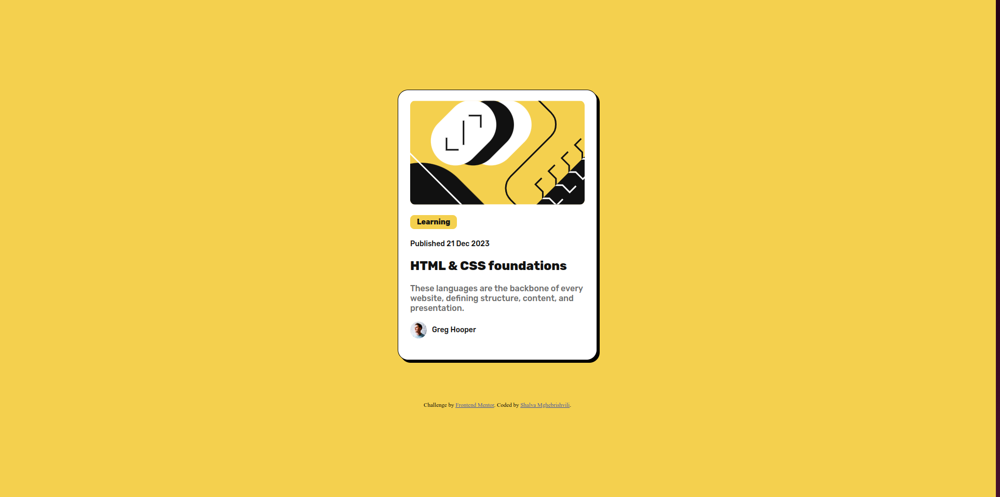

# Frontend Mentor - Blog preview card solution

This is a solution to the [Blog preview card challenge on Frontend Mentor](https://www.frontendmentor.io/challenges/blog-preview-card-ckPaj01IcS).

## Table of contents

- [Overview](#overview)
  - [The challenge](#the-challenge)
  - [Screenshot](#screenshot)
  - [Links](#links)
- [My process](#my-process)
  - [Built with](#built-with)
  - [What I learned](#what-i-learned)
  - [Continued development](#continued-development)
  - [Useful resources](#useful-resources)
- [Author](#author)
- [Acknowledgments](#acknowledgments)

## Overview

### The challenge

Users should be able to:

- See hover and focus states for all interactive elements on the page

### Screenshot



### Links

- Solution URL: https://github.com/Shako-IT/Blog_preview_card.git
- Live Site URL: https://shako-it.github.io/Blog_preview_card/

## My process

### Built with

- Semantic HTML5 markup
- CSS custom properties
- Flexbox
- Desktop-first workflow

### What I learned

I improved my CSS skills, I was challenged to center the card horizontally and vertically and I did it after a research and CSS rules recap.
I also learned to use the figma file better.

This is how I managed to center the card. It's a parent box design.

```css
.container {
  background-color: hsl(47, 88%, 63%);
  height: 100vh;
  display: flex;
  justify-content: center;
  align-items: center;
}
```

### Continued development

This challenge was a really good experience for me. I need to improve semantic HTML with CSS.

## Author

- Website - [Shalva Mghebrishvili](https://github.com/Shako-IT)
- Frontend Mentor - [@Shako-IT](https://www.frontendmentor.io/profile/Shako-IT)
